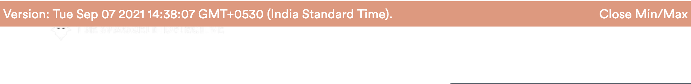
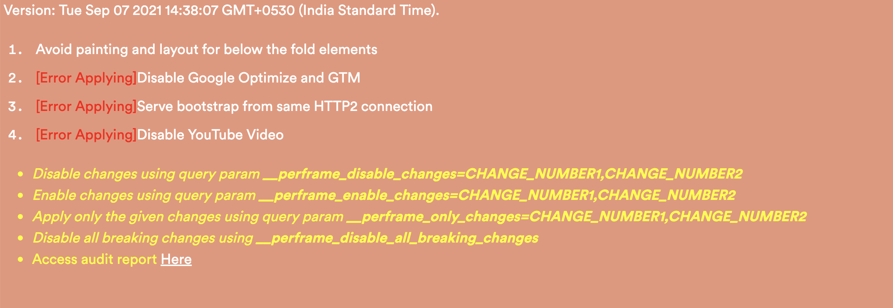
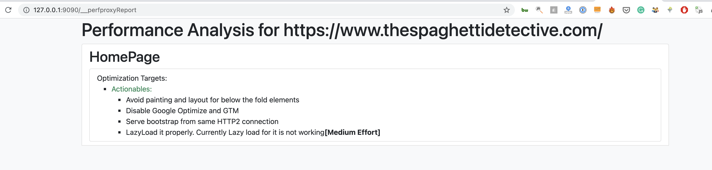

# Perframe

The PERFormance FRAMEwork that provides you a way to declaratively apply changes to your website on the fly with automatic "Optimization Report" generation from the declarative configuration.

On the fly changes are applied using [Cloudflare Workers](https://workers.cloudflare.com/).

## Status

This is in completely usable state but it is still not polished well.

## Why Perframe

1.  Provides a well documented proof of working for Performance Optimization Ideas which can be followed by the developer to do the changes.
2.  Provides a declarative way to make modifications to the website. It is very easy to try out modifications.
3.  Edge Proxied website is almost bugless as compared to scraped websites(which don't always work)
4.  Consistent way to test your ideas across any Performance Tool. PSI doesn't have resource blocking but WebPageTest does. It would allow you to test resource blocking on PSI as well.

## Features:

- Ideas Testing

  Document ideas in a declarative fashion in `audits/${WEBSITE}/pages.js` file and keep the code to apply the changes along with it.

  - Negligible Difference in Proxied and Original Website's Performance
    - _Almost no impact on TTFB_ due to optimizations being applied on Cached Responses.
    - HTML Responses are cached at Edge and automatically cache busted on new deployment.
    - Note that [HTMLRewriter](https://developers.cloudflare.com/workers/runtime-apis/html-rewriter) which is much faster than string replacements isn't used in this project so that I can get the same code working in ServiceWorker as well as Cloudflare Worker.

  - Test directly on Production Environment

    - Measure performance improvement over Production Data
    - Measure performance in Production Flows

  - Declarative(`audits/${WEBSITE}/pages.js`)

    - Logical Grouping of String Replacements in Response(HTML/CSS/JS)
    - Request blocking/Resource Disabling supported within the framework

  - Routing Support

    - Define a new endpoint by creating a file in `audits/${WEBSITE}/proxycontent` folder. See the example audit for actual usage.

  - Configuration

    - An Optimization `Change` can be disabled using `disabled` property in `pages.js`
    - A list of changes can be disabled using query param `__perframe_disable_changes=CHANGE_NUMBER1,CHANGE_NUMBER2`
    - A single change or a list of changes can be forced to be enabled and all other disabled using query param `__perframe_only_changes=CHANGE_ID1, CHANGE_ID2`

  - UI based Configuration

    - Lists down all `Changes` on the page itself in a dedicated Perframe UI. The UI is visible with `__perframe_ui=1` query param.

- Development

  - SuperFast Dev Experience using ServiceWorker. Test your changes directly on ServiceWorker which provides a much better debugging experience then Cloudflare Workers. This is possible because Cloudflare Workers is using Service Workers API with some modifications.
  - HTML Responses are cached and automatically cache busted on new deployment.
  - Express server run under nodemon so that it restarts automatically and reruns on changes
  - Automatically Publish to Cloudflare Worker on file save.
    - Detects when new change has propagated on CF-worker.
  - Auto Refresh for the local page
    - Keep showing in UI that the change hasn't propagated yet.
  - VSCode auto-opens terminals with proper names and in split view(ProxyServer and Watch together). This is achieved using VSCode tasks.

- Better Debugging

  - Replacements might stop working when the website response changes. Perframe detects and logs which replacement failed.
  - Versioning of every update to Worker.
    - Shows the version on webpage itself at top right.
  - Configuration to apply breaking changes or not. Use Query Param `__perframe_disable_all_breaking_changes`
    - Breaking changes would improve performance but would break the functionality and thus would require developer effort to fix that.

- Plugins

  - Shopify

    - Page Categorization Support

      - Collection, Product, Homepage

## Usage Instructions

1. Get a Cloudflare Account and register for Cloudflare Workers. It's free
2. Make a note of your Cloudflare Worker domain.(This is available on the right side in your Cloudflare Worker section).
3. Replace YOUR_DOMAIN in `environment.js` and `publish.mjs` with your Cloudflare Worker subdomain.
4. Create wrangler.toml(Use wrangler.example.toml as the base)
5. [Install and configure Wrangler](https://developers.cloudflare.com/workers/cli-wrangler)
6. Keep the following 2 commands running:

   - `pnpm run start`
     - _Proxy Server is required to fetch the content from http://127.0.0.1 to avoid CORS restrictions in Service Worker. These are not applicable to Cloudflare Workers_.
   - `AUDIT=AUDIT_FOLDER_NAME pnpm run watch`

     - e.g. `AUDIT=thespaghettidetective pnpm run watch`
     - _Keep the watch running which would automatically build and push changes to Cloudflare Worker._

   - If you are using VSCode there is a [VSCode task](https://code.visualstudio.com/docs/editor/tasks) **'Create Terminals'** written that automatically runs the above two commands on startup. If it doesn't run on startup you can run the task manually using VSCode Command Panel

7. Optimized website would be available `https://127.0.0.1:9090/?__optimization=1` - Port can't be easily changed right now. You would need to replace all 9090 occurrences in the code.
8. You can access the Perframe UI on the website by adding query param `__perframe_ui=1`. This is how it would look  
9. This is how generated report would look 
10. Before and after impact can be observed by removing and adding `__optimization=1` query param. Note that individual optimizations can also be disabled instead of disabling all optimizations at once.

## Tips

- While debugging in console add `-file` in Chrome Console Filter to not see the resources that have been blocked. **Perframe** blocks resources by replacing the resource URLs with `file://` URLs.

- To audit the proxied website locally in Chrome Lighthouse(ServiceWorker based), use Chrome Lighthouse with **Clear LocalStorage** option ticked off. Manually clear Local Storage(if you need it) using Application tab with **Unregister Service Worker Option** ticked off
